# Project Sirius — Graphics Roadmap

**Файл:** `docs/GRAPHICS_ROADMAP.md`  
**Дата:** 2026-06-09 (статусы сверены с кодом 2026-06-14)
**Статус:** дизайн-документ для реализации  

> **Прогресс (сверка с кодом, `main`, 2026-06-14):**
>
> | Фаза | Статус | Подтверждение в коде |
> |---|---|---|
> | Phase 0 — Render Backend abstraction | ✅ закрыта (де-факто) | `Graphics/Backends/{Null,OpenGL,Vulkan}` + интерфейсный слой `IRenderContext/I*`-ресурсов + `RenderBackendSelector`; golden-гейт GL↔VK. Формальный `IRenderBackend` из этого дока не вводился — seam реализован слоем IRenderContext, цель (безопасный шов + parity) достигнута |
> | Phase 1 — HDR и пост на OpenGL | ✅ закрыта целиком 2026-06-11 (вкл. SMAA 1x) | `Render/HdrFramePipeline.cs`: RGBA16F, ACES+exposure, bloom (Karis 13-tap), god rays, FXAA 3.11 — ON по умолчанию; SMAA 1x (`Shaders/Smaa*`, LUT EmbeddedResource, селектор в options); пер-пасс GPU-тайминги `SIRIUS_PASS_TIMINGS` |
> | Phase 2 — свет и PBR | ✅ закрыта 2026-06-11 | 2.1 linear workflow (`includes/ColorSpace.hlsl`, CPU-декод INI-цветов) → 2.2 PBR-фикс затухания + `Render/Materials/MaterialNormalizer.cs` → 2.3 BRDF LUT → 2.4 IBL-пробы (`Render/EnvironmentProbe.cs`, t5/t6/t7) → 2.5 CSM 3 каскада (`Render/ShadowMapRenderer.cs`, атлас 3072×1024) → 2.6 локальные спот-тени (атлас 2×2 512²) → 2.7 UI-настройки PERFORMANCE. Гейты GL 1.0×3 / VK 0.999+ |
> | Phase 3 — Vulkan backend | ✅ закрыта 2026-06-10 | `Backends/Vulkan/*`: device/swapchain/sync, дескриптор-кэш (persistent uniform-сеты + контентно-адресуемые текстурные), пул транзиент-буферов, PSO-кэш; SSIM-parity гейт пройден, **Vulkan — бэкенд по умолчанию**. Не делалось: async compute (6.10) |
> | Phase 4 — RT/mesh/VRS tier | ✅ закрыта 2026-06-12 (mesh — experimental) | 7.1–7.4 RT-стек целиком: ray query (BLAS/TLAS `VKAccelerationStructures`, сборщик `RayTracedScene`), RT-тени солнца + RTAO + RT-отражения v1 (UI-тоглы, `rt_golden_gate.sh`, CSM-каскады скипаются при RT); 7.5 mesh shaders: тулчейн+рантайм+мешлетизатор сданы (смоук рисует), эмиссия кубов заблокирована внешним багом DXC 1.9×NVIDIA — фича experimental/off (сага в memory); 7.6 VRS pipeline-tier: 2×2 на старсфере (RenderDoc-доказано), attachment-tier — отказ (на 5090 выигрыш ниже шума), фича off-by-default |
> | Phase 5 — volumetrics/GI/DLSS | 🔶 volumetrics foundation in progress | В коде уже есть feature-gated froxel volumetric nebula path: `NebulaVolumeProfile`, froxel resources, density/light/integrate/composite passes, depth-aware composite, material fog binding, temporal/reprojection scaffolds, blue-noise/STBN import scaffold, near cascade, ship displacement/wake/curl, god-ray attenuation, lightning channels/art profiles, atmosphere LUT/cloud-shell scaffolds and OpenVDB manifest bridge. Не закрыто: DDGI, upscaler/DLSS, motion vectors/reactive masks, refraction, audio RT, final visual/perf gates |
> | 9. Инструменты | 🔶 mostly implemented | `SIRIUS_PASS_TIMINGS`, `SIRIUS_VK_STATS`, debug labels+object names (`VK_EXT_debug_utils`), Dev HUD (`SIRIUS_DEV_HUD`), validation gate `vk_validate_run.sh`, debug views (`SIRIUS_DEBUG_VIEW`), screenshots/snapshots. RenderDoc in-app hook now logs device/window/capture counts and fallback attempts, but local smoke on 2026-06-14 still does **not** emit `.rdc`; external RenderDoc/GFXReconstruct remain required for capture proof |
> | 10. Тестирование | 🔶 частично | golden-гейт SSIM GL/VK (`scripts/golden_gate.sh`) + маски + герметичный UI-автотест (`SIRIUS_UI_AUTOTEST`) + мульти-разрешения (`SIRIUS_WINDOW_SIZE`); юнит-тесты точечные (MaterialNormalizer); полного CI-конвейера нет |

**Целевая аудитория:** графические инженеры, engine/runtime инженеры, tools/QA, technical art  
**Контекст:** LibreLancer / Project Sirius, C#/.NET 10.0, текущий OpenGL backend, будущий Vulkan backend

---

## 0. Executive Summary

Project Sirius должен пройти путь от OpenGL-forward рендера LibreLancer к современному backend-agnostic renderer с HDR, полноценным PBR, IBL, тенями, Vulkan, ray tracing, mesh shaders, VRS, volumetrics и апскейлингом/Frame Generation. Ключевой принцип: **не ломать совместимость с оригинальными форматами Freelancer и Discovery Freelancer 4.86**, а строить современную графику поверх существующего контентного слоя `UTF/MAT/CMP/DFM/VMS/ALE`.

Самый важный инженерный вывод по текущему коду: проект уже имеет несколько удачных точек для эволюции, но ещё не имеет настоящего абстрактного render backend.

Текущие сильные стороны:

- `SystemRenderer.Draw()` уже организован как последовательный набор проходов: MSAA target, depth pre-pass, opaque pass, asteroid fields, nebulae, billboards/particles, starsphere, transparent pass, final blit. Это почти готовая основа для frame graph.
- В `LibreLancer.Base/Graphics/Backends` уже существует низкоуровневый `IRenderContext` и реализации `OpenGL`/`Null`, но это не полноценный `IRenderBackend`: он смешивает window/swap, state cache, resource factory и draw calls.
- Шейдерная система уже компилирует HLSL через DXC в SPIR-V и затем через SPIRV-Cross получает GLSL/DXIL/MSL. Для Vulkan это стратегическое преимущество: не нужно начинать шейдерный pipeline с нуля.
- `SurfaceFormat.HdrBlendable` и `SurfaceFormat.HalfVector4` уже мапятся в `GL_RGBA16F`, поэтому HDR на OpenGL можно внедрить до Vulkan.
- MAT-парсер уже прокидывает `Nm/Mt/Rt`, `RFactor`, `MFactor` в `BasicMaterial`; PBR не нужно “изобретать”, нужно довести до physically plausible linear/HDR pipeline.

Главная стратегия:

1. **Phase 0:** немедленно ввести высокий `IRenderBackend` и зафиксировать текущее GL-поведение golden tests.
2. **Phase 1:** получить видимый визуальный апгрейд без риска Vulkan: HDR, bloom, god rays, FXAA/SMAA.
3. **Phase 2:** стабилизировать физику света: linear workflow, Cook-Torrance, IBL, CSM/local shadows.
4. **Phase 3:** реализовать Vulkan backend так, чтобы OpenGL и Vulkan выполняли один и тот же frame graph.
5. **Phase 4:** включить Vulkan/RTX-фичи как optional feature tiers: RT shadows, RTAO, RT reflections, mesh shaders, VRS.
6. **Phase 5:** добавить volumetric fog, DDGI/RTXGI-style GI, DLSS/Frame Generation, refraction и экспериментальный RT audio.

---

## 1. Исходное состояние по коду

### 1.1 Главная точка рендера

Текущая сцена собирается в `src/LibreLancer/Render/SystemRenderer.cs`.

Семантический порядок кадра сейчас такой:

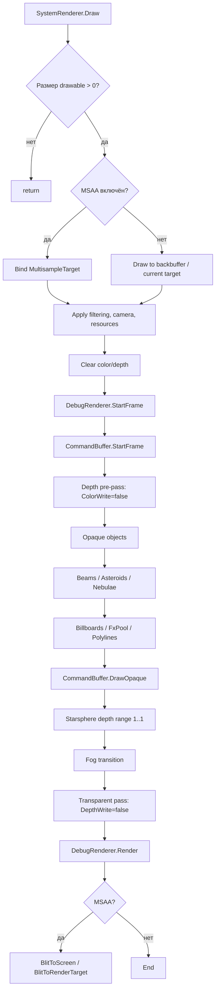

**Инженерный вывод:** Phase 1 должен не переписывать `SystemRenderer`, а вынести этот порядок в `FrameGraph`/`RenderFrame`:

```text
SystemRenderer.Draw()
  -> FrameGraph.BeginFrame()
  -> DrawSceneOpaqueAndTransparent(frameTargets.HdrColor, frameTargets.Depth)
  -> PostProcessGraph.Execute()
  -> Present()
```

### 1.2 Текущий backend слой

Сейчас есть `RenderContext`, который выглядит как frontend-state-cache, но на практике тесно связан с OpenGL:

- `RenderContext` хранит state (`BlendMode`, `DepthWrite`, `ColorWrite`, `Cull`, `RenderTarget`, `Shader`, viewport/scissor stack).
- Внутри есть `IRenderContext Backend`, но это низкоуровневый интерфейс: resource factories + state apply + swapwindow + query fences + direct draw.
- `SDL3Game` создаёт именно `GLRenderContext.Create(sdlWin)` и затем `new RenderContext(renderBackend)`.
- `GLRenderContext` сам создаёт GL context, выбирает GL 4.3/3.1 fallback, проверяет SSBO availability, держит texture slots и делает `SwapWindow`.

Текущий слой полезен для перехода, но его нельзя считать целевым backend API: он не выражает swapchain, command buffers, pipeline state objects, descriptors, barriers, queue ownership, async compute и explicit synchronization.

### 1.3 Текущий command buffer

`src/LibreLancer/Render/CommandBuffer.cs` называется command buffer, но opaque-команды фактически исполняются сразу:

```text
AddCommand(...)
  if material opaque:
      SetWorld()
      material.Use()
      geometry.Draw()
  else:
      store transparent command for later sorting
```

**Вывод:** в Phase 0 нельзя просто “переиспользовать CommandBuffer как Vulkan command buffer”. Нужно разделить:

- `RenderQueueBuilder` — собирает render items, сортировку, material buckets.
- `FrameCommandEncoder` — записывает backend commands.
- `BackendCommandList` — Vulkan/GL implementation detail.

### 1.4 Материалы и PBR

MAT-парсер уже знает:

- diffuse color/texture: `Dc`, `Dt`
- emissive color/texture: `Ec`, `Et`
- normal map: `Nm`
- metal map: `Mt`
- roughness map: `Rt`
- detail map: `Bt/Dm`
- scalar factors: `MFactor`, `RFactor`
- glass/material special cases.

`Material.Initialize()` передаёт эти данные в `BasicMaterial`, включая `Roughness = RFactor` и `Metallic = MFactor`.

В `BasicMaterial` PBR включается, если есть roughness/metal maps или scalar roughness/metallic и lighting включён. В PBR path bindятся `Dt`, `Et`, `Nt`, `Mt`, `Rt`.

**Проблема:** текущий PBR shader возвращает gamma-corrected цвет (`pow(color, 1/2.2)`) прямо из material pass. Для HDR/tonemapping это нужно изменить: material pass должен писать **linear HDR radiance**, а gamma/sRGB должен быть единственным финальным шагом post-process.

### 1.5 Шейдерный pipeline

`LLShaderCompiler` уже:

1. читает shader description;
2. генерирует feature permutations;
3. компилирует HLSL через DXC в SPIR-V;
4. через SPIRV-Cross генерирует GLSL;
5. дополнительно генерирует DXIL/MSL;
6. упаковывает bytecode bundle как embedded resource.

Это значит: Vulkan backend должен сначала использовать уже существующий SPIR-V path и reflection metadata, а не вводить второй shader compiler.

### 1.6 Render targets и HDR-ready формат

`SurfaceFormat` уже содержит:

- `HalfVector4`
- `HdrBlendable`
- `Vector4`
- `Depth`

OpenGL mapping уже переводит `HdrBlendable`/`HalfVector4` в `GL_RGBA16F`. Текущий `RenderTarget2D` создаёт `Texture2D` без возможности указать формат, поэтому Phase 1 требует расширить constructors:

```csharp
public RenderTarget2D(RenderContext context, int width, int height,
    SurfaceFormat colorFormat = SurfaceFormat.Bgra8,
    SurfaceFormat depthFormat = SurfaceFormat.Depth);
```

Аналогично `MultisampleTarget` сейчас hardcoded RGBA8/depth24, значит для HDR+MSAA нужен:

```csharp
public MultisampleTarget(RenderContext context, int width, int height,
    int samples,
    SurfaceFormat colorFormat = SurfaceFormat.HdrBlendable,
    DepthFormat depthFormat = DepthFormat.Depth24);
```

---

## 2. Vision: целевое состояние графики

### 2.1 Визуальная цель

Project Sirius в финальном состоянии должен выглядеть как современный space-sim remake, а не как “старый Freelancer с высоким разрешением”.

Финальная картинка:

- **HDR linear lighting** во всех 3D material passes.
- **Filmic tonemapping** с controlled exposure и корректным UI composite.
- **Physically based ships/stations**: metal/roughness/normal/emissive интерпретация из существующих MAT-данных + compatibility fallbacks.
- **IBL для каждого star system**: diffuse irradiance + prefiltered specular от starsphere/nebula environment.
- **Bloom/glow** от двигателей, звёзд, emissive ship parts, weapon FX и trade lanes.
- **God rays** от солнц и ярких крупных источников, сначала screen-space, затем volumetric integration.
- **Cascaded sun shadows** для кораблей, станций, астероидов, крупных solar объектов.
- **Local light shadows** для docking bays, station lights, weapon muzzle flashes по priority budget.
- **Ray traced contact shadows** на Vulkan/RTX tier.
- **RTAO** для стыков корпуса, ангаров, деталей станций, крупных астероидов.
- **RT reflections** на металлических корпусах кораблей, high-glass/cockpit/canopy материалах и shield surfaces.
- **Volumetric nebula fog** с ray marching, density noise, light shafts и temporal reprojection.
- **DDGI/RTXGI-style probe GI** для станций, базовых комнат, плотных астероидных полей и туманностей.
- **DLSS/Frame Generation path** для high-refresh 4K gameplay на RTX 50-class hardware.
- **Feature tiers**, чтобы игра оставалась доступной без RTX.

### 2.2 Измеримые цели качества

| Область | Цель | Метрика при acceptance |
|---|---:|---|
| Цветовой pipeline | Единый linear HDR до tonemap | material passes не делают gamma-correction; gamma только в final output |
| HDR target | `RGBA16F` scene color | no clipping для emissive > 1.0, bloom threshold работает в HDR |
| Bloom | Звёзды/двигатели читаются на 4K без washout | bloom GPU cost ≤ 1.2 ms на RTX 5090 @ 4K |
| God rays | Солнце даёт screen-space light shafts | ≤ 0.8 ms @ 4K half-res |
| PBR | Cook-Torrance + GGX + Fresnel Schlick + energy conservation | reference shader tests ΔE < 2.0 для тестовых материалов |
| IBL | Diffuse irradiance + specular prefilter | no black ambient на shadowed metal/rough materials |
| CSM | 4 cascades для солнца | stable shadows, no shimmering при медленном camera pan |
| Vulkan parity | GL/Vulkan raster parity | SSIM ≥ 0.999 на golden scenes без post effects |
| Vulkan performance | CPU overhead ниже GL на heavy scene | ≥ 30% меньше render-thread CPU time в scene with 10k draw items |
| RT tier | RT shadows/AO/reflections | fallback без RT сохраняет gameplay readability |
| Volumetrics | Nebula has physical depth | temporal stable, ≤ 2.5 ms high preset @ 4K internal |
| Upscaling | 4K high-refresh mode | 4K@240 display target через upscaling/Frame Generation tier, нативный simulation tick не привязан к FG |

### 2.3 Performance tiers

| Tier | GPU target | Resolution target | Features |
|---|---|---:|---|
| Low / Compatibility | OpenGL 4.3 / Vulkan 1.2 GPU without RT | 1080p60 | SDR/HDR optional, FXAA, no RT, simple shadows |
| Medium | RTX 3060 / RX 6700-class | 1440p60-90 | HDR, bloom, IBL, CSM medium, no RT or AO low |
| High | RTX 4070 / RX 7800-class | 1440p120 / 4K60 | HDR, bloom, god rays, IBL, CSM high, local shadows, optional RTAO |
| Ultra RTX | RTX 5090 24GB dev target | 4K120 native / 4K240 with upscaling+FG | RT shadows, RTAO, RT reflections, volumetrics, mesh shaders, VRS |
| Cinematic capture | RTX 5090 | 4K/8K offline-ish capture | max samples, slower denoisers, debug visual outputs |

### 2.4 Target render stack

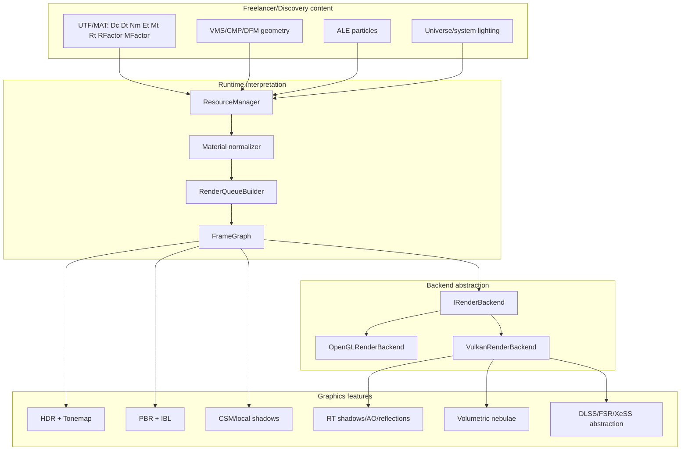

---

## 3. Roadmap overview

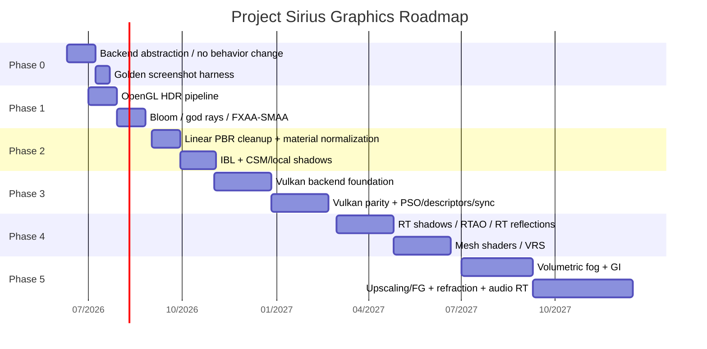

---

# Phase 0 — Абстрактный Render Backend ✅ _(закрыта де-факто: слой IRenderContext + Backends/{Null,OpenGL,Vulkan} + golden parity; формальный IRenderBackend не вводился)_

**Срок:** немедленно, 4–6 недель  
**Главная цель:** refactor без изменения картинки и поведения.  
**Definition of Done:** старый OpenGL path и новый `OpenGLRenderBackend : IRenderBackend` дают одинаковые golden screenshots в фиксированных сценах.

## 3.1 Целевой API

Создать namespace:

```text
src/LibreLancer.Base/Graphics/Backend/
    IRenderBackend.cs
    RenderBackendCapabilities.cs
    RenderBackendDescription.cs
    RenderFrameContext.cs
    RenderCommandList.cs
    RenderPipelineState.cs
    RenderResourceDesc.cs
    RenderBackendFactory.cs
```

### 3.1.1 `IRenderBackend`

```csharp
namespace LibreLancer.Graphics.Backend;

public interface IRenderBackend : IDisposable
{
    RenderBackendKind Kind { get; }
    RenderBackendDescription Description { get; }
    RenderBackendCapabilities Capabilities { get; }

    void Initialize(RenderBackendCreateInfo createInfo);
    ISwapchain CreateSwapchain(WindowHandle window, SwapchainDesc desc);

    ITexture CreateTexture(in TextureDesc desc, string? debugName = null);
    IBuffer CreateBuffer(in BufferDesc desc, string? debugName = null);
    ISampler CreateSampler(in SamplerDesc desc);

    IShaderProgram CreateShaderProgram(in ShaderProgramDesc desc);
    IGraphicsPipeline CreateGraphicsPipeline(in GraphicsPipelineDesc desc);
    IComputePipeline CreateComputePipeline(in ComputePipelineDesc desc);

    IRenderCommandList CreateCommandList(CommandListKind kind, string? debugName = null);

    void BeginFrame();
    void Submit(in SubmitInfo submit);
    void Present(ISwapchain swapchain);
    void EndFrame();

    void WaitIdle();

    IDisposable PushDebugGroup(string name, Color4 color);
    void SetObjectName(object backendObject, string name);
}
```

### 3.1.2 `RenderBackendCapabilities`

```csharp
[Flags]
public enum RenderFeature
{
    None = 0,
    HDR = 1 << 0,
    MultisampleResolve = 1 << 1,
    StorageBuffers = 1 << 2,
    Compute = 1 << 3,
    AsyncCompute = 1 << 4,
    TimelineSemaphores = 1 << 5,
    RayTracingPipeline = 1 << 6,
    RayQuery = 1 << 7,
    MeshShader = 1 << 8,
    FragmentShadingRate = 1 << 9,
    DescriptorIndexing = 1 << 10,
    DebugMarkers = 1 << 11,
}

public sealed record RenderBackendCapabilities(
    RenderFeature Features,
    int MaxTexture2DSize,
    int MaxSamples,
    float MaxAnisotropy,
    ulong DedicatedVideoMemoryBytes,
    bool SupportsComputeQueue,
    bool SupportsTransferQueue,
    bool SupportsPresentMailbox);
```

### 3.1.3 Command list

```csharp
public interface IRenderCommandList : IDisposable
{
    void Begin(string debugName);
    void End();

    void BeginRendering(in RenderingInfo info);
    void EndRendering();

    void SetViewport(Viewport viewport);
    void SetScissor(Rectangle scissor);
    void SetPipeline(IGraphicsPipeline pipeline);
    void SetComputePipeline(IComputePipeline pipeline);
    void SetVertexBuffer(IBuffer buffer, int slot, ulong offset);
    void SetIndexBuffer(IBuffer buffer, IndexFormat format, ulong offset);
    void SetDescriptorSet(int set, IDescriptorSet descriptors);
    void PushConstants<T>(ShaderStage stages, int offset, in T data) where T : unmanaged;

    void Draw(int vertexCount, int instanceCount, int firstVertex, int firstInstance);
    void DrawIndexed(int indexCount, int instanceCount, int firstIndex, int vertexOffset, int firstInstance);
    void Dispatch(int groupCountX, int groupCountY, int groupCountZ);

    void TransitionTexture(ITexture texture, ResourceState before, ResourceState after);
    void CopyBufferToTexture(IBuffer src, ITexture dst, in CopyBufferTextureRegion region);
    void Blit(ITexture src, ITexture dst, in BlitRegion region, TextureFilter filter);
}
```

## 3.2 Важное правило Phase 0

`IRenderBackend` должен быть **выше**, чем текущий `IRenderContext`.

Текущий `IRenderContext` можно временно оставить как `LegacyRenderContextBackend` или `IGraphicsDeviceLegacy`, но новый API должен выражать:

- swapchain;
- render targets;
- command lists;
- resource states;
- buffers/images;
- shader programs;
- graphics/compute pipeline state;
- debug labels;
- explicit synchronization.

## 3.3 Конкретные действия

### Step 0.1 — Architecture freeze

Создать branch:

```bash
git checkout -b graphics/phase0-render-backend
```

Запретить feature work в рендере без feature flag:

```text
RendererSettings.ExperimentalGraphicsRoadmap = false
```

Все Phase 0 changes должны быть behavior-preserving.

### Step 0.2 — Inventory direct GL calls

Собрать список прямых зависимостей:

```bash
rg "using LibreLancer\.Graphics\.Backends\.OpenGL|GL\." src/LibreLancer src/LibreLancer.Base src/Editor
```

Создать файл:

```text
docs/render_gl_dependency_inventory.md
```

Сгруппировать:

| Категория | Примеры | Phase 0 action |
|---|---|---|
| backend-only GL | `GLRenderContext`, `GLTexture2D`, `GLShader` | оставить внутри OpenGL backend |
| platform GL | `SDL3Game` creates GL context | вынести в backend factory |
| screenshots | `SDL3Game.Screenshot` uses `GL.ReadPixels` | заменить на backend readback |
| editor preview | editor-specific GL usage | адаптер через backend debug texture handle |
| shader compilation | GL-specific GLSL output | оставить как GL shader backend |

### Step 0.3 — Backend selection

Добавить:

```csharp
public enum RendererKind
{
    OpenGL,
    Vulkan,
    Null
}

public sealed class GameConfiguration
{
    public RendererKind Renderer { get; init; } = RendererKind.OpenGL;
}
```

CLI:

```bash
lancer --renderer opengl
lancer --renderer vulkan
lancer --renderer null
```

Config:

```ini
[graphics]
renderer = opengl
```

### Step 0.4 — SDL window split

Текущий `SDL3Game` создаёт `SDL_WINDOW_OPENGL`. Нужно ввести:

```csharp
public interface IWindowBackendBinding
{
    WindowHandle CreateWindow(GameConfiguration config);
    IRenderBackend CreateBackend(WindowHandle window, GameConfiguration config);
}
```

Реализации:

```text
SdlOpenGLBinding
    window flags: SDL_WINDOW_OPENGL
    backend: OpenGLRenderBackend

SdlVulkanBinding
    window flags: SDL_WINDOW_VULKAN
    creates VkSurfaceKHR via SDL_Vulkan_CreateSurface
    backend: VulkanRenderBackend

SdlNullBinding
    no GPU
```

### Step 0.5 — Preserve `RenderContext` as frontend facade

На Phase 0 не переписывать весь рендер. Обернуть текущий API:

```text
RenderContext
  -> RenderStateCache
  -> IRenderBackend legacy-compatible path
  -> OpenGLRenderBackend
```

На этом этапе допустимо, что `OpenGLRenderBackend` внутри вызывает текущий `GLRenderContext`.

### Step 0.6 — Replace static global assumptions

Найти и убрать/изолировать:

```csharp
RenderContext.Instance
```

Целевой вариант:

```csharp
RenderFrameContext frame
frame.RenderContext
frame.Backend
frame.Targets
```

В Phase 0 можно оставить compatibility shim, но новые классы не должны зависеть от `RenderContext.Instance`.

### Step 0.7 — Render target descriptors

Добавить descriptors:

```csharp
public readonly record struct TextureDesc(
    int Width,
    int Height,
    int MipLevels,
    TextureDimension Dimension,
    SurfaceFormat Format,
    TextureUsage Usage,
    int SampleCount);

[Flags]
public enum TextureUsage
{
    Sampled = 1 << 0,
    RenderTarget = 1 << 1,
    DepthStencil = 1 << 2,
    Storage = 1 << 3,
    TransferSrc = 1 << 4,
    TransferDst = 1 << 5,
    Present = 1 << 6,
}
```

`RenderTarget2D` должен получить format-aware constructor.

### Step 0.8 — Golden screenshots before refactor

Добавить test harness:

```text
src/LibreLancer.Tests/Render/
    RenderGoldenTest.cs
    RenderTestScene.cs
    ImageDiff.cs
    GoldenBaselines/
```

Команда:

```bash
dotnet test src/LibreLancer.Tests \
  --filter "Category=RenderGolden"
```

Сцены:

| Scene ID | Что покрывает |
|---|---|
| `golden_basic_ship` | CMP/VMS geometry, BasicMaterial |
| `golden_pbr_ship` | Nm/Mt/Rt/RFactor/MFactor |
| `golden_transparency_glass` | HighGlass/Glass alpha sorting |
| `golden_asteroids` | asteroid field renderer |
| `golden_nebula` | nebula renderer + fog |
| `golden_particles_engine` | FxPool, trails, billboards |
| `golden_starsphere` | depth range starsphere path |
| `golden_ui_overlay` | 2D renderer after 3D |

### Step 0.9 — Determinism mode

Добавить:

```csharp
public sealed class RenderDeterminismSettings
{
    public bool FreezeTime = true;
    public double FixedTime = 0.0;
    public int RandomSeed = 1337;
    public bool DisableAsyncResourceUploads = true;
    public bool DisableParticlesRandomness = true;
    public bool DisableMSAA = true;
    public bool DisablePostProcessing = true;
}
```

Для Phase 0 golden parity:

- MSAA off;
- post off;
- fixed camera;
- fixed time;
- fixed window size;
- deterministic sorting;
- no dynamic resource streaming mid-frame.

### Step 0.10 — Screenshot comparison

`ImageDiff`:

```csharp
public sealed record ImageDiffResult(
    int Width,
    int Height,
    double MeanAbsoluteError,
    int MaxChannelError,
    double Psnr,
    double Ssim,
    double PixelMismatchRatio);
```

Acceptance:

| Mode | Criteria |
|---|---|
| Phase 0 same backend refactor | exact match or `MaxChannelError <= 1`, `Mismatch <= 0.1%` |
| GL vs Vulkan Phase 3 | `SSIM >= 0.999`, `MAE <= 0.75`, no object-ID mismatch |
| Post effects | perceptual diff, `SSIM >= 0.995`, histogram guardrails |

### Step 0.11 — CI gate

Add test categories:

```csharp
[Trait("Category", "RenderGolden")]
[Trait("Backend", "OpenGL")]
```

CI policy:

| Check | On every PR | Nightly |
|---|---:|---:|
| unit tests | yes | yes |
| backend resource tests | yes | yes |
| OpenGL golden small set | optional GPU runner | yes |
| Vulkan golden | no until Phase 3 | yes |
| performance benchmarks | no | yes |
| RenderDoc capture smoke | no | weekly |

## 3.4 Phase 0 exit checklist

- [ ] `RendererKind` config exists.
- [ ] `IRenderBackend` exists.
- [ ] `OpenGLRenderBackend` wraps existing GL behavior.
- [ ] No new direct `GL.*` outside OpenGL backend.
- [ ] `RenderTarget2D` supports explicit color/depth format.
- [ ] Golden screenshot harness exists.
- [ ] Phase 0 GL before/after screenshots pass.
- [ ] `CommandBuffer` rename plan documented: `CommandBuffer` -> `RenderQueueBuilder`.
- [ ] `SDL3Game` no longer hardcodes GL creation in generic game path.
- [ ] Developer doc: `docs/RENDER_BACKEND_GUIDELINES.md`.

---

# Phase 1 — Пост-обработка на OpenGL ✅ _(закрыта целиком 2026-06-11, включая SMAA 1x)_

**Срок:** месяц 1–2  
**Главная цель:** заметно улучшить картинку до Vulkan: HDR, bloom, god rays, anti-aliasing.  
**Constraint:** работает на OpenGL backend; Vulkan не нужен.

## 4.1 Target frame graph

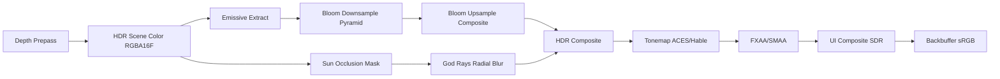

## 4.2 Render targets

Создать `RenderFrameTargets`:

```csharp
public sealed class RenderFrameTargets : IDisposable
{
    public RenderTarget2D HdrColor;
    public RenderTarget2D HdrResolved;
    public DepthBuffer Depth;
    public RenderTarget2D EmissiveMask;
    public RenderTarget2D[] BloomMips;
    public RenderTarget2D GodRayMask;
    public RenderTarget2D GodRayBlur;
    public RenderTarget2D LdrColor;
}
```

Formats:

| Target | Format | Size | Usage |
|---|---|---:|---|
| `HdrColor` | `HalfVector4/HdrBlendable` | full | scene HDR |
| `HdrResolved` | `HalfVector4` | full | MSAA resolve target |
| `Depth` | `Depth24` or current `Depth` | full | depth prepass/scene |
| `EmissiveMask` | `HalfVector4` | full or half | bloom source |
| `BloomMip0..N` | `HalfVector4` | 1/2 .. 1/64 | bloom pyramid |
| `GodRayMask` | `R8` or `HalfSingle` | half | sun occlusion |
| `GodRayBlur` | `HalfSingle` | half | radial blur |
| `LdrColor` | `Bgra8` or swapchain format | full | tonemapped |

## 4.3 `SystemRenderer` changes

Current:

```csharp
SetRenderTarget(msaaTarget or null)
Draw scene
if msaa: BlitToScreen
```

Target:

```csharp
public void Draw(ICamera camera, double totalTime, bool forceCull, Rectangle viewport)
{
    var frame = frameGraph.BeginFrame(camera, totalTime, viewport);
    DrawScene(frame, camera, totalTime, forceCull);
    postProcessor.Execute(frame);
    uiComposite.Execute(frame);
    frameGraph.Present(frame);
}
```

Intermediate compatibility:

```csharp
private void DrawSceneToCurrentTarget(ICamera camera, double totalTime, bool forceCull)
{
    // move existing SystemRenderer.Draw body here, but remove final MSAA blit
}
```

## 4.4 HDR pass ✅

### Actions

1. Add `GraphicsSettings.HdrEnabled`.
2. Add `RenderTarget2D(... SurfaceFormat.HdrBlendable ...)`.
3. Replace final direct backbuffer drawing with HDR target.
4. Modify PBR and non-PBR material shaders:
   - output linear HDR;
   - remove `pow(color, 1/2.2)` from material pass;
   - only sample color textures with explicit sRGB handling.
5. Add tonemap shader:

```hlsl
float3 ACESFitted(float3 x)
{
    float3 a = x * (x + 0.0245786) - 0.000090537;
    float3 b = x * (0.983729 * x + 0.4329510) + 0.238081;
    return saturate(a / b);
}
```

6. Add exposure:

```ini
[graphics]
hdr = true
exposure = 1.0
tonemapper = aces
```

7. Output conversion:
   - if GL framebuffer sRGB is enabled: output linear and let fixed function convert;
   - otherwise output `pow(color, 1.0 / 2.2)` in final pass only.
   - choose one path and assert it in debug overlay.

### Acceptance

- White texture at 1.0 remains white after tonemap.
- Emissive > 1.0 blooms but does not hard clip before tonemap.
- UI remains crisp and not tonemapped twice.

## 4.5 Bloom / glow ✅

### Source

Bloom source should include:

- stars/suns;
- engine trails;
- weapon beams;
- emissive textures (`Et`);
- high-brightness particles;
- trade lane effects;
- docking lights.

### Implementation

Passes:

```text
BloomExtract.hlsl
BloomDownsample.hlsl
BloomUpsample.hlsl
BloomComposite.hlsl
```

Algorithm:

1. Extract bright pixels:

```hlsl
float luminance = dot(hdr.rgb, float3(0.2126, 0.7152, 0.0722));
float knee = threshold * softKnee;
float contribution = smoothstep(threshold - knee, threshold + knee, luminance);
out.rgb = hdr.rgb * contribution;
```

2. Downsample to 1/2, 1/4, 1/8, 1/16, 1/32.
3. Upsample with tent filter.
4. Composite:

```hlsl
hdr.rgb += bloom.rgb * BloomIntensity;
```

Settings:

```ini
bloom = true
bloom_threshold = 1.2
bloom_intensity = 0.18
bloom_radius = 0.65
bloom_mips = 6
```

Acceptance:

- Bloom cost ≤ 1.2 ms @ 4K on RTX 5090.
- No persistent flicker in particle-heavy scenes.
- Bloom disabled yields bitwise-identical HDR scene before tonemap.

## 4.6 God rays ✅

Start with screen-space radial blur.

Inputs:

- sun world position from system light/sun;
- depth buffer;
- optional sun sprite mask.

Passes:

1. `SunMaskPass`
   - project sun to screen.
   - if behind camera: skip.
   - generate small mask based on sun disk and depth occlusion.
2. `RadialBlurPass`
   - half-res.
   - 32–64 samples depending quality.
   - weighted decay from sun screen position.
3. Composite into HDR.

Shader params:

```csharp
struct GodRayParams
{
    Vector2 SunScreenPosition;
    float Exposure;
    float Decay;
    float Density;
    float Weight;
    float Clamp;
}
```

Settings:

```ini
god_rays = true
god_rays_quality = medium
god_rays_samples = 48
god_rays_intensity = 0.35
```

Acceptance:

- Rays disappear when sun is behind camera.
- Rays are occluded by large ships/stations/asteroids using depth.
- Cost ≤ 0.8 ms @ 4K half-res.

## 4.7 FXAA / SMAA ✅ _(FXAA ✅ по умолчанию; SMAA 1x ✅ 2026-06-11 — Shaders/Smaa*, includes/SmaaPort.hlsl, Render/SmaaTextures.cs; 0.07 мс @1440p)_

### Phase 1 order

1. Implement FXAA first.
2. Implement SMAA after HDR/bloom stable.

Recommended order:

```text
HDR Scene -> Bloom/GodRays -> Tonemap -> FXAA/SMAA -> UI
```

UI should not be blurred by FXAA unless specifically rendering UI into same target. Prefer UI after anti-aliasing.

Settings:

```ini
anti_aliasing = fxaa | smaa | msaa | off
```

Policy:

- `MSAA` and post-AA can coexist only if explicitly selected.
- Default high preset: `SMAA`.
- Default compatibility preset: `FXAA`.

## 4.8 Phase 1 exit checklist ✅ _(полный, включая SMAA — фаза 1 закрыта целиком 2026-06-11)_

- [ ] HDR target and tonemap pass implemented.
- [ ] PBR material pass outputs linear HDR.
- [ ] Non-PBR basic shaders audited for gamma.
- [ ] Bloom with mips implemented.
- [ ] Engine/stars/emissive materials feed bloom.
- [ ] God rays half-res radial blur implemented.
- [ ] FXAA implemented.
- [ ] SMAA implemented or scheduled as Phase 1.5.
- [ ] UI composite after post-processing.
- [ ] Debug overlay shows per-pass GPU times.
- [ ] Golden screenshots updated with post off/on baselines.
- [ ] Settings exposed in config and runtime debug menu.

---

# Phase 2 — Улучшенное освещение ✅ _(закрыта 2026-06-11, подфазы 2.1–2.7)_

**Срок:** месяц 3–4  
**Главная цель:** physically plausible lighting on OpenGL and future Vulkan.

## 5.1 Linear lighting cleanup ✅

### Required changes

1. All texture color samples:
   - diffuse/albedo/emissive maps are decoded from sRGB to linear;
   - normal/metal/rough maps are sampled as linear data.
2. All light math happens in linear.
3. Material shaders output linear HDR.
4. Tonemap pass outputs display space.
5. UI stays in SDR/sRGB pipeline, composited after 3D.

### Shader audit list

| Shader group | Action |
|---|---|
| `PBR.frag.hlsl` | remove final gamma, add IBL/shadow hooks |
| `Basic.frag.hlsl` | decide if legacy material stays gamma-like or moves to linear |
| `Nebula` | keep artistic color but output HDR-compatible linear |
| `Particles` | make emissive intensity explicit |
| `Starsphere` | feed background/IBL capture path |
| `Atmosphere` | ensure blend in linear HDR |
| `Sun` | explicit physical-ish intensity, bloom source |

## 5.2 PBR BRDF ✅ _(баг затухания из аудита подтверждён и исправлен; MaterialNormalizer)_

Use Cook-Torrance:

```text
Lo = Σ (kD * albedo / π + specular) * radiance * NdotL
specular = D_GGX * G_Smith * F_Schlick / (4 * NdotV * NdotL)
```

Parameters:

| Parameter | Source | Fallback |
|---|---|---|
| Albedo | `Dt * Dc` | `Dc` |
| Normal | `Nm` | vertex normal |
| Roughness | `Rt` or `RFactor` | material heuristic |
| Metallic | `Mt` or `MFactor` | material heuristic |
| Emissive | `Et * Ec` | `Ec` |
| Occlusion | future AO or vertex data | 1.0 |

### Material normalization

Add:

```csharp
public readonly record struct NormalizedMaterialParams(
    Vector4 BaseColor,
    float Metallic,
    float Roughness,
    float Alpha,
    float EmissiveStrength,
    bool HasNormalMap,
    bool HasMetallicMap,
    bool HasRoughnessMap,
    MaterialDomain Domain);
```

Add `MaterialNormalizer`:

```text
src/LibreLancer/Render/Materials/MaterialNormalizer.cs
```

Rules:

| MAT input | Current behavior | Target behavior |
|---|---|---|
| `MFactor` missing | PBR path can default metallic to 1 when enabled | default metallic = 0 unless explicit metal map/factor or material heuristic |
| `RFactor` missing | roughness default = 1 | keep roughness = 0.65 for old ship hulls unless explicit |
| `GlassMaterial` | envmapglass special path | refraction/reflection domain |
| `Et` | emissive texture | HDR emissive with bloom strength |
| `Oc/Ot` | alpha | alpha domain sorted/blended |

### Important bug audit

In current PBR shader, verify local-light distance calculation. If the shader normalizes `surfaceToLight` before measuring distance, attenuation becomes wrong because distance collapses to 1. Correct pattern:

```hlsl
float3 lightVector = light.position - worldPosition;
float distanceToLight = length(lightVector);
float3 L = lightVector / max(distanceToLight, 1e-5);
```

Add shader unit test for attenuation.

## 5.3 Image-Based Lighting ✅ _(EnvironmentProbe: irradiance 16² + prefiltered 64²×5 mips + BRDF LUT)_

### Goal

Every star system gets an environment:

```text
EnvironmentMap
  IrradianceCube      32x32 or 64x64
  PrefilteredSpecular 128x128/256x256 with mips
  BRDF_LUT            256x256 RG16F
```

### Sources

Priority:

1. System-specific authored cubemap if added later.
2. Capture starsphere/nebula to cubemap at load.
3. Procedural fallback from ambient color + sun direction.
4. Neutral grey debug fallback.

### Pipeline

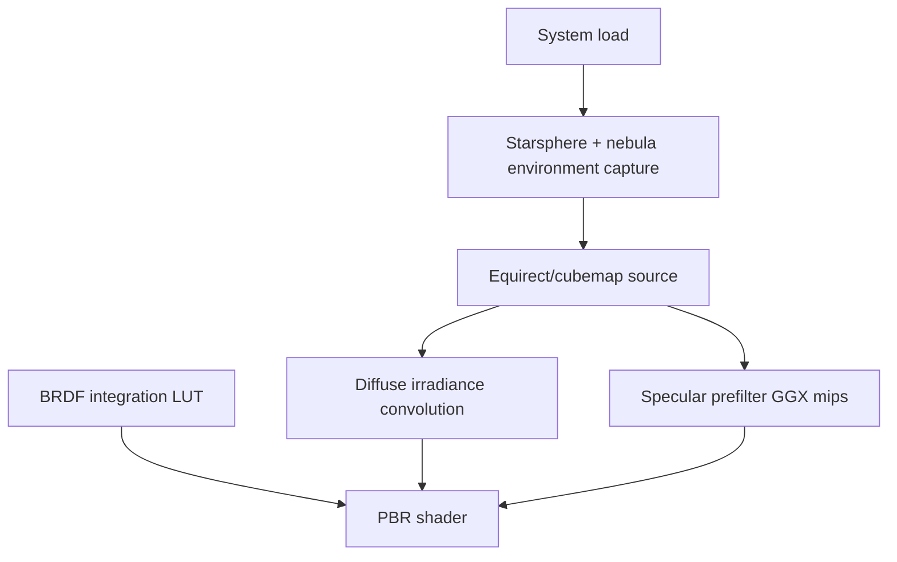

### Implementation steps

1. Add `EnvironmentProbe` resource:

```csharp
public sealed class EnvironmentProbe : IDisposable
{
    public TextureCube Irradiance;
    public TextureCube PrefilteredSpecular;
    public Texture2D BrdfLut;
    public float AmbientIntensity;
    public float ReflectionIntensity;
}
```

2. Add `SystemEnvironmentBuilder`.
3. At `LoadSystem`, build or load cached environment.
4. Add debug UI:
   - show cubemap face;
   - show roughness mip;
   - freeze environment.
5. Bind to PBR shader:
   - `t_irradianceCube`
   - `t_prefilteredSpecular`
   - `t_brdfLut`

### Acceptance

- Metal surfaces are not black in shadow.
- Roughness changes reflection blur.
- Environment changes between systems.

## 5.4 Cascaded Shadow Maps ✅ _(3 каскада, цветовой атлас 3072×1024, PCF 2×2 point)_

### Goals

- Directional sun shadows for ships, stations, asteroids, large solars.
- Stable cascades with minimal shimmering.
- Works in OpenGL first, maps cleanly to Vulkan.

### Data structures

```csharp
public sealed class DirectionalShadowMap
{
    public RenderTarget2D Atlas;
    public Matrix4x4[] LightViewProj = new Matrix4x4[4];
    public Vector4 CascadeSplits;
    public int CascadeCount;
    public int Resolution;
}
```

### Cascade config

| Preset | Cascades | Atlas | Filter |
|---|---:|---:|---|
| Low | 2 | 2048² | 2x2 PCF |
| Medium | 3 | 4096² | 3x3 PCF |
| High | 4 | 4096²/8192² | 5x5 PCF |
| Ultra | 4 | 8192² | PCSS/EVSM optional |

### Render pass

```text
ShadowCasterPass
  for cascade in cascades:
      set viewport atlas tile
      draw opaque shadow casters
      alpha-test materials use alpha cutout
```

### Stabilization

- Snap light projection to texel grid.
- Keep cascade split scheme stable.
- Use camera near/far clamp relevant to space scale.
- Avoid including starsphere/nebula/particles.

### Material flags

```csharp
[Flags]
public enum MaterialRenderFlags
{
    CastShadow = 1 << 0,
    ReceiveShadow = 1 << 1,
    AlphaTestShadow = 1 << 2,
    EmissiveNoShadow = 1 << 3,
}
```

### Acceptance

- Shadow edge stable during slow camera pan.
- No shadows from starsphere, trails, particles.
- Alpha-tested panels cast approximate cutout shadows.
- Shadow pass CPU/GPU time visible in overlay.

## 5.5 Local light shadows ✅ _(до 4 спотов, атлас 2×2 512²)_

Local lights are currently forward-packed with a small cap. Target:

- priority-based shadow allocation;
- atlas for spot/point lights;
- local shadows only for important lights.

### Priority formula

```text
priority = screenRadius * intensity * importance / distancePenalty
```

### Atlas

| Light type | Shadow method |
|---|---|
| Spot | 2D atlas tile |
| Point | cubemap array or 6 atlas tiles |
| Weapon flash | usually no shadow; optional contact fake |
| Docking bay | persistent cached shadow |

### Acceptance

- No more than N shadowed local lights per frame (`N=4 medium`, `N=8 high`, `N=16 ultra`).
- Visible debug overlay: selected shadowed lights and atlas occupancy.
- No frame spikes when many lights appear; allocation is amortized.

## 5.6 Phase 2 exit checklist ✅

- [ ] Linear/HDR workflow audited.
- [ ] PBR output no longer gamma-corrects in material pass.
- [ ] MaterialNormalizer added.
- [ ] PBR attenuation bug fixed if confirmed.
- [ ] BRDF LUT generated or shipped.
- [ ] IBL irradiance/prefilter generated per system.
- [ ] CSM pass implemented.
- [ ] Local shadow atlas implemented.
- [ ] Debug overlays for PBR, IBL, shadow cascades.
- [ ] Golden images for PBR/shadow scenes.
- [ ] Performance budget documented per preset.

---

# Phase 3 — Vulkan Backend ✅ _(закрыта 2026-06-10: SSIM-parity, Vulkan по умолчанию; кроме 6.10 async compute)_

**Срок:** месяц 5–8  
**Главная цель:** `VulkanRenderBackend : IRenderBackend` выполняет тот же frame graph, что OpenGL backend.  
**Constraint:** сначала parity, затем optimization. Нельзя делать RT/mesh shader до baseline Vulkan parity.

## 6.1 Vulkan architecture

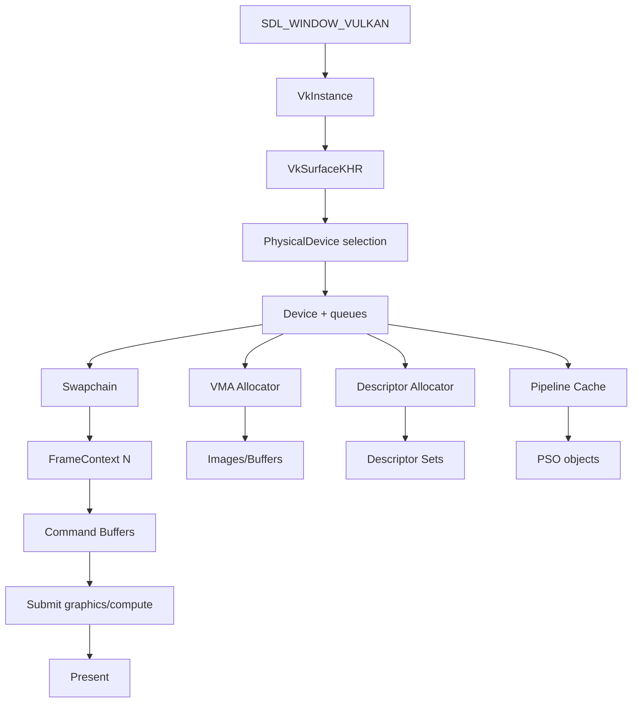

## 6.2 Project layout

```text
src/LibreLancer.Base/Graphics/Backends/Vulkan/
    VulkanRenderBackend.cs
    VulkanInstance.cs
    VulkanDevice.cs
    VulkanSwapchain.cs
    VulkanQueue.cs
    VulkanFrameContext.cs
    VulkanCommandList.cs
    VulkanTexture.cs
    VulkanBuffer.cs
    VulkanSampler.cs
    VulkanDescriptorAllocator.cs
    VulkanPipelineCache.cs
    VulkanShaderProgram.cs
    VulkanSynchronization.cs
    VulkanMemoryAllocator.cs
    VulkanDebug.cs
    VulkanFormatConversions.cs
```

Bindings options:

| Option | Pros | Cons | Recommendation |
|---|---|---|---|
| Silk.NET Vulkan | mature C# bindings | dependency + style mismatch | good default |
| Vortice.Vulkan | modern .NET | evaluate support cadence | evaluate |
| Native custom P/Invoke | full control | high maintenance | avoid unless necessary |
| C++ native backend DLL | mature Vulkan C++ + VMA | boundary complexity | viable if C# binding blocks progress |

Recommended for Phase 3: **C# Vulkan binding + native VMA wrapper only if needed**. Keep renderer code in C#.

## 6.3 Instance and device

### Required instance extensions

- SDL-provided WSI extensions from `SDL_Vulkan_GetInstanceExtensions`.
- `VK_EXT_debug_utils` in dev builds.

### Device extension baseline

| Extension / feature | Required? | Use |
|---|---:|---|
| Vulkan 1.2 | yes | timeline semaphores core, descriptor improvements |
| Vulkan 1.3 | preferred | dynamic rendering/synchronization2 if available |
| `VK_KHR_swapchain` | yes | present |
| `VK_KHR_timeline_semaphore` | preferred/fallback | frame sync |
| `VK_KHR_synchronization2` | preferred | clearer barriers |
| `VK_EXT_descriptor_indexing` | optional Phase 3, important later | bindless-ish texture arrays |
| `VK_KHR_acceleration_structure` | Phase 4 | RT |
| `VK_KHR_ray_tracing_pipeline` | Phase 4 | RT effects |
| `VK_EXT_mesh_shader` | Phase 4 | asteroid meshlets |
| `VK_KHR_fragment_shading_rate` | Phase 4 | VRS |

## 6.4 Memory management

Use VMA.

### Allocation classes

| Resource type | VMA usage/pool |
|---|---|
| static vertex/index buffers | GPU-only, transfer dst |
| dynamic per-frame uniform/storage | CPU-to-GPU ring, persistently mapped |
| textures | GPU-only, staging upload |
| readback screenshots/tests | GPU-to-CPU |
| transient frame targets | dedicated transient pool |
| BLAS/TLAS | GPU-only with device address |

### Debug naming

Every allocation should carry:

```text
category:path/resource:purpose
```

Examples:

```text
texture:ships/liberty_elite.mat/diffuse
texture:systems/li01/starsphere_env_prefilter_mip4
buffer:vmesh:li_elite_body:vertex
rt:frame:hdr_color
blas:ship:rh_battleship
```

### Memory budget overlay

Add overlay:

| Metric | Source |
|---|---|
| texture bytes | existing `EstimatedTextureMemory` + backend actual |
| buffer bytes | VMA stats |
| render target bytes | frame graph |
| BLAS/TLAS bytes | RT allocator |
| heap usage/budget | VMA budget if available |

## 6.5 Descriptors

### Descriptor set layout strategy

Align with current HLSL register spaces.

Suggested sets:

| Set | Name | Contents |
|---:|---|---|
| 0 | Frame | camera, lighting, environment, frame constants |
| 1 | Material | textures/samplers/material constants |
| 2 | Object | world matrix, bones, object params |
| 3 | Pass | shadow cascade, post-process params |
| 4 | Bindless optional | texture arrays after descriptor indexing |

### Descriptor allocator

Implement:

```csharp
public sealed class VulkanDescriptorAllocator
{
    public VkDescriptorSet Allocate(VkDescriptorSetLayout layout, DescriptorLifetime lifetime);
    public void ResetFramePools(int frameIndex);
    public void GarbageCollect();
}
```

Lifetimes:

- `PerFrame`
- `PerMaterial`
- `Persistent`
- `Transient`

## 6.6 Pipeline State Objects

OpenGL currently mutates state per material. Vulkan needs immutable PSOs.

### `GraphicsPipelineDesc`

```csharp
public readonly record struct GraphicsPipelineDesc(
    ShaderProgramHandle Shader,
    VertexLayoutDesc VertexLayout,
    RenderTargetFormatSet Formats,
    DepthStencilState DepthStencil,
    BlendState Blend,
    RasterizerState Rasterizer,
    PrimitiveTopology Topology,
    SampleCount Samples,
    string DebugName);
```

### Pipeline key

```text
hash(shader bytecode ids,
     feature mask,
     vertex layout,
     color/depth formats,
     blend,
     depth,
     cull,
     topology,
     sample count)
```

Cache:

```text
Cache/Graphics/Pipelines/vulkan/{driver_hash}/{pipeline_hash}.bin
```

### Pipeline warmup

At system load:

1. enumerate loaded materials;
2. build expected shader feature masks;
3. precreate common PSOs async;
4. fallback to synchronous creation with visible profiler marker if missed.

## 6.7 Synchronization

### Frame-in-flight model

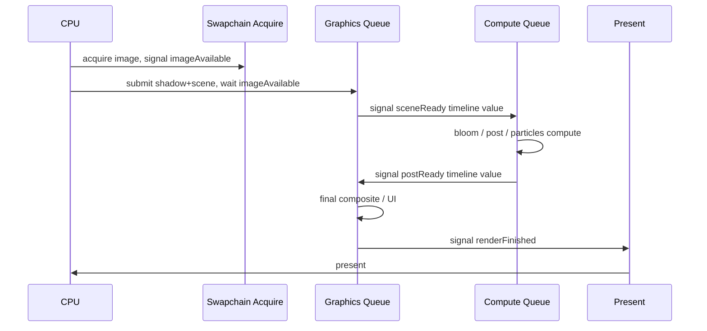

### Policy

- Use timeline semaphores for GPU-GPU sequencing where supported.
- Use binary semaphores for swapchain acquire/present compatibility.
- Fence per frame context for CPU resource reuse.
- Barriers generated by frame graph resource transitions.
- Queue ownership transfer only when async compute actually uses separate queue family.

### Resource states

```csharp
public enum ResourceState
{
    Undefined,
    RenderTarget,
    DepthWrite,
    DepthRead,
    ShaderRead,
    ShaderWrite,
    TransferSrc,
    TransferDst,
    Present,
    AccelerationStructureBuild,
    AccelerationStructureRead,
}
```

Frame graph owns transitions:

```text
Pass declares:
  reads:  depth as DepthRead, hdrColor as ShaderRead
  writes: bloomMip0 as RenderTarget
FrameGraph builds:
  barriers + layout transitions + queue sync
```

## 6.8 Shader path

### Use existing SPIR-V

`LLShaderCompiler` already compiles SPIR-V. Vulkan backend should:

1. load SPIR-V bytecode from `BytecodesBundle`;
2. reflect descriptor sets/bindings;
3. create `VkShaderModule`;
4. create pipeline layout;
5. validate HLSL register spaces match backend descriptor plan.

### Required compiler changes

Add option:

```bash
LLShaderCompiler --target vulkan --emit-reflection-json
```

Reflection JSON:

```json
{
  "entryPoints": ["main"],
  "stages": ["vertex", "fragment"],
  "descriptorSets": [
    { "set": 0, "binding": 0, "type": "uniform_buffer", "name": "Camera" },
    { "set": 1, "binding": 0, "type": "combined_image_sampler", "name": "DtSampler" }
  ],
  "pushConstants": [],
  "vertexInputs": []
}
```

## 6.9 Vulkan parity plan

### Phase 3A — clear triangle/backend smoke

- Create window.
- Create swapchain.
- Clear to color.
- Draw hardcoded triangle.
- Screenshot readback.

### Phase 3B — 2D renderer

- Port `Renderer2D`.
- Draw UI test quads.
- Font atlas and text.

### Phase 3C — static model

- Port `VertexBuffer`, `ElementBuffer`, `Texture2D`, `Shader`.
- Draw one CMP/VMS mesh with `BasicMaterial`.

### Phase 3D — current full scene

- Port storage buffers for world matrices/bones/lights.
- Port particles/billboards/beams.
- Port render targets and MSAA resolve.
- Execute same `FrameGraph`.

### Phase 3E — post-processing

- Bloom/tonemap/god rays on graphics queue.
- Then async compute variant.

### Phase 3F — parity gates

Golden scenes:

| Scene | GL | VK | Criteria |
|---|---:|---:|---|
| basic ship | yes | yes | geometry and material match |
| PBR ship | yes | yes | linear HDR diff after tonemap |
| nebula | yes | yes | visual/perceptual match |
| particles | yes | yes | deterministic seed |
| UI overlay | yes | yes | exact or near exact |

Acceptance:

```text
SSIM >= 0.999
MAE <= 0.75
Max channel error <= 4 for 99.9% pixels
No missing geometry
No wrong alpha sorting bucket
```

## 6.10 Async compute ⬜ _(не реализовано — отложено)_

Only after Vulkan graphics path is stable.

Candidates:

| Workload | Async suitability | Notes |
|---|---|---|
| bloom down/up | high | low dependency after HDR scene |
| tone mapping | medium | final composite may need graphics |
| particles simulation | high | if data moved GPU-side |
| culling | high | future meshlet/compute culling |
| DDGI probe update | high | Phase 5 |
| RT denoise | high | Phase 4 |

Implementation rule:

- start disabled by default;
- enable with GPU timestamp proof;
- never add async queue if it increases total frame time due to synchronization stalls.

## 6.11 Phase 3 exit checklist ✅ _(кроме async compute)_

- [ ] Vulkan window/surface/swapchain works via SDL.
- [ ] Vulkan backend implements `IRenderBackend`.
- [ ] VMA or equivalent allocator integrated.
- [ ] Descriptor allocator implemented.
- [ ] Pipeline cache implemented.
- [ ] Shader SPIR-V path works.
- [ ] Render targets/depth/MSAA resolve work.
- [ ] Storage buffers/UBOs mapped correctly.
- [ ] 2D UI renderer works.
- [ ] Full system scene renders.
- [ ] GL/Vulkan golden parity passes.
- [ ] Validation layers clean in dev mode.
- [ ] RenderDoc captures readable markers.
- [ ] GPU timings per pass available.
- [ ] Async compute proof-of-value documented.

---

# Phase 4 — Vulkan-специфичные эффекты ⬜ _(не начата — СЛЕДУЮЩАЯ по пайплайну)_

**Срок:** месяц 9–12  
**Главная цель:** использовать Vulkan/RTX features без разрушения raster fallback.

## 7.1 Feature tier matrix

| Feature | Vulkan required | OpenGL fallback | Default tier |
|---|---:|---|---|
| RT shadows | yes | CSM/contact fake | Ultra RTX |
| RTAO | yes | SSAO/HBAO | High/Ultra |
| RT reflections | yes | SSR + IBL probes | Ultra RTX |
| Mesh shaders | yes | vertex/index LOD | High/Ultra if supported |
| VRS | yes | lower-res background passes | High/Ultra |

## 7.2 Ray traced shadows

### Goal

Hybrid shadows:

```text
Sun shadow = CSM for broad coverage + RT contact shadow for close/medium range
```

### Acceleration structures

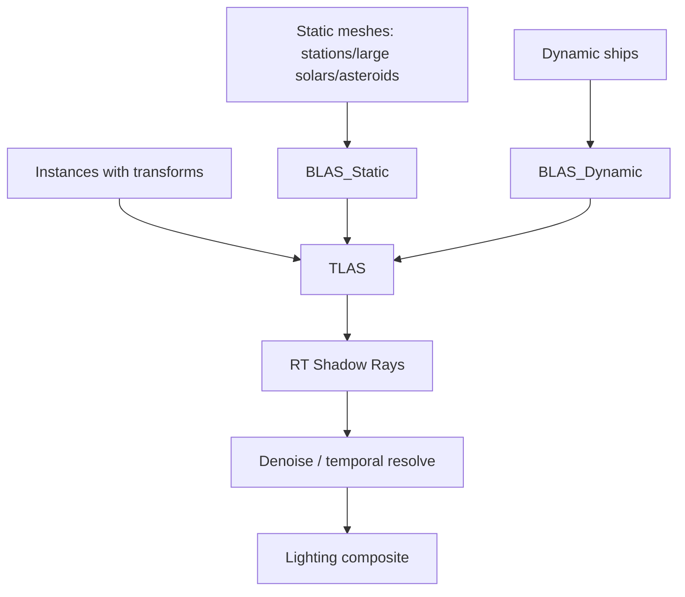

### BLAS strategy

| Object class | BLAS policy |
|---|---|
| static station/solar | build once, compact |
| asteroid field chunks | build per chunk/LOD, cache |
| ships | build per mesh, instance per object |
| DFM/skinned characters | exclude initially; later refit/update if needed |
| particles/trails/beams | exclude |
| shields | exclude from shadow, include in reflections optional |

### Shadow ray pass

Inputs:

- TLAS;
- depth buffer;
- normal buffer or reconstruct normal;
- sun direction;
- world position from depth.

Output:

- `R8` shadow factor, half/full-res depending preset.

Shader:

```hlsl
RayDesc ray;
ray.Origin = worldPos + normal * bias;
ray.Direction = -SunDirection;
ray.TMin = 0.01;
ray.TMax = ShadowDistance;
TraceRay(...);
```

Denoise:

- spatial filter using normal/depth;
- temporal accumulation with motion vectors in Phase 5;
- clamp history to avoid ghosting on fast ships.

Acceptance:

- No acne on ship hulls.
- Contact shadow visible under/inside station geometry.
- Cost target:
  - High: half-res ≤ 1.2 ms
  - Ultra: full-res ≤ 2.5 ms

## 7.3 RTAO

### Goal

Replace or augment SSAO with ray traced ambient occlusion.

Pass:

```text
Depth + normals -> RTAO rays -> AO texture -> temporal/spatial denoise -> lighting multiply
```

Settings:

| Preset | Rays/pixel | Resolution | Radius |
|---|---:|---:|---:|
| Low | SSAO fallback | half | 5–20 m |
| High | 1 ray | half/checkerboard | 20–80 m |
| Ultra | 2–4 rays | full/checkerboard | 80–250 m |

Acceptance:

- Better grounding in docking bays/stations.
- No halo around thin geometry.
- Temporal stable during camera rotation.

## 7.4 Ray traced reflections

### Goal

Improve reflections on:

- metallic ship hulls;
- glass cockpit/canopy;
- high-glass station panels;
- shields.

Hybrid reflection stack:

```text
SSR first
  if miss -> RT reflection
  if rough/high distance -> IBL fallback
```

### Material filter

RT reflections only if:

```text
metallic > 0.4 OR material domain == Glass OR Shield
roughness < 0.45 for sharp RT
roughness < 0.75 for blurred RT fallback
```

### Output

Reflection radiance target:

- half-res for performance;
- full-res only for cinematic.

Denoise:

- roughness-aware spatial filter;
- temporal reprojection after motion vectors added.

Acceptance:

- Ships reflect nearby station lights/large ships.
- Rough metal uses blurred reflection or IBL.
- Glass refraction/reflection does not explode alpha sorting.

## 7.5 Mesh shaders for asteroids

> **Status 2026-06-12: experimental, off by default.** Тулчейн (DXC ms_6_5,
> бандлы, VKShader mesh-пайплайны, DrawMeshTasks), мешлетизатор кубов и
> рендер-путь (`mesh_asteroids`, UI ASTEROID PIPELINE) сданы и проходят
> валидацию; смоук-шейдер рисует на любом ракурсе. Боевая эмиссия кубов
> заблокирована воспроизводимым багом кодгена DXC 1.9 × NVIDIA
> (буферные вершинные данные × полная эмиссия → 0 фрагментов при
> валидном mesh-выводе в RenderDoc-реплее). Диагностическая сага и план
> следующего захода — в memory (graphics_phase4_status).

### Goal

Asteroid fields are ideal for mesh shader modernization:

- many repeated objects;
- heavy LOD/culling;
- large fields;
- low gameplay-critical precision.

### Pipeline

1. Convert asteroid meshes into meshlets at load/build time.
2. Store meshlet bounds/cones.
3. Mesh shader culls:
   - frustum;
   - distance LOD;
   - cone backface;
   - optional occlusion.
4. Emit triangles directly.

Data:

```csharp
public sealed class MeshletAsset
{
    public Meshlet[] Meshlets;
    public byte[] VertexData;
    public uint[] Indices;
    public BoundingSphere[] Bounds;
}
```

Acceptance:

- Same visual density as raster path.
- ≥ 25% GPU time reduction in heavy asteroid field.
- Fallback path works without mesh shader support.

## 7.6 Variable Rate Shading

> **Status 2026-06-12: pipeline-tier реализован, off by default.**
> `VK_KHR_fragment_shading_rate`: probe + перечень доступных рейтов в лог,
> статический rate в PSO-ключе (динамик-стейт отброшен — one-shot пассы
> кубмап-бейков не ходят через BindDynamicState), хук в
> `DrawStarsphereLayers` шейдит старсферу 2×2 (доказано RenderDoc:
> единственный rate-(2,2) дро кадра — композит), корабли/HUD/текст 1×1
> by construction (рисуются после сброса рейта). UI-тогл VARIABLE RATE
> SHADING, `SIRIUS_NO_VRS=1` эскейп. Attachment-tier (rate image по
> importance) — отказ: на RTX 5090 фон-пасс ~0.1 мс, выигрыш ниже шума
> замера; вернуться при profiling-боттлнеке фона на слабом железе.
> Защита: VRS-структура прикрепляется только к rate≠1 пайплайнам.

### Goal

Spend less shading on:

- starsphere;
- distant nebula background;
- low-motion peripheral background.

Never apply VRS to:

- UI;
- ship cockpit/target;
- text;
- thin silhouettes near player;
- weapon reticles.

### Modes

| Mode | Rate |
|---|---|
| Center screen / targets | 1x1 |
| background stars | 2x2 |
| low-contrast nebula | 2x2/4x4 |
| motion/edge/high luminance | 1x1 |

### Implementation

- VRS image attachment generated per frame.
- Use depth/object mask to protect foreground.
- Debug overlay visualizes shading rate map.

Acceptance:

- No visible degradation in screenshots at normal gameplay.
- Saves ≥ 0.5 ms in 4K heavy background scenes.

## 7.7 Phase 4 exit checklist

- [ ] BLAS/TLAS manager implemented.
- [ ] Static/dynamic geometry classification exists.
- [ ] RT shadow pass implemented.
- [ ] RTAO pass implemented.
- [ ] RT reflection hybrid stack implemented.
- [ ] Denoisers implemented and profiled.
- [ ] Meshlet builder for asteroids implemented.
- [ ] Mesh shader rendering path implemented.
- [ ] VRS attachment path implemented.
- [ ] All features have non-RT/non-mesh fallback.
- [ ] Feature support matrix exposed in graphics settings.
- [ ] GPU captures annotated and stored for reference.

---

# Phase 5 — Продвинутая графика 🔶 _(volumetrics foundation в работе)_

**Срок:** месяц 13–18  
**Главная цель:** high-end visual identity: volumetric space, GI, upscaling/Frame Generation, refraction, experimental audio RT.

## 8.1 Volumetric fog in nebulae

### Current implementation status, 2026-06-14

The Phase 5 nebula path is no longer just a roadmap item. Current `main`
contains a feature-gated froxel stack:

- Runtime `NebulaVolumeProfile` mapping from legacy Freelancer/Discovery
  nebula zones without moving canonical zone placement.
- Froxel allocation/clear, procedural profile density injection,
  Beer-Lambert/dual-HG-oriented lighting and front-to-back integration.
- Opt-in HDR composite with scene-depth sampling, material fog binding,
  temporal history/reprojection scaffolds, generated/imported blue-noise/STBN
  support and debug views.
- Near cascade, high-frequency near detail, ship displacement capsules,
  persistent wake history and velocity-aligned curl wake.
- Volumetric god-ray/sun burnthrough attenuation and segmented lightning
  channel injection with art profiles, flash count and afterglow.
- Atmosphere LUT/cloud-shell resource scaffolds and OpenVDB import manifests
  with canonical placement lock, source/license/source-file/hash metadata and
  dense voxel budget checks.

The default renderer remains fallback-safe: legacy nebula drawing is still used
unless the explicit volumetric flags are enabled and the Vulkan/compute path is
available. The remaining work is visual/performance convergence, stronger
world-space sampling, real authored volume cache/import, golden captures, and
the non-volumetric Phase 5 items below.

### Goal

Replace flat/legacy nebula feel with physical depth.

### Representation

```text
NebulaVolume
  bounds: oriented box/sphere/field
  density: 3D noise + authored masks
  color: system/faction/zone authored
  scattering: Henyey-Greenstein phase
  lighting: sun + local lights + emissive particles optional
```

### Pipeline

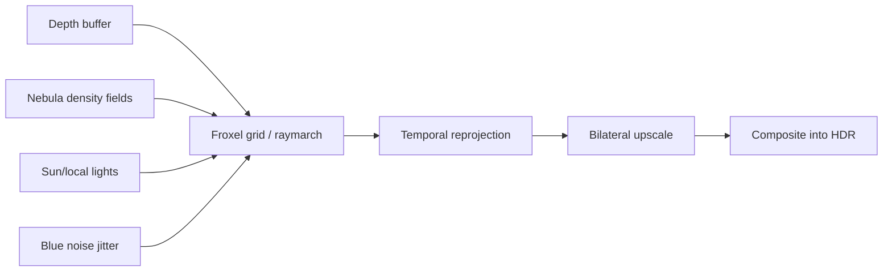

### Algorithm

- Render at half or quarter resolution.
- Raymarch from camera to scene depth.
- Step count adaptive by density/distance.
- Use blue noise jitter.
- Temporal accumulation with history clamping.
- Composite before transparent glass/shields, after opaque.

Settings:

```ini
volumetric_nebula = true
volumetric_composite = true
volumetric_temporal = true
volumetric_reprojection = true
volumetric_blue_noise = true
volumetric_adaptive_quality = true
volumetric_near_cascade = true
volumetric_near_composite = true
volumetric_near_detail = true
volumetric_ship_displacement = true
volumetric_wake_history = true
volumetric_wake_curl = true
volumetric_god_rays = true
volumetric_material_fog = true
volumetric_lightning_channels = true
volumetric_lightning_deterministic = true
volumetric_lightning_golden_disable = true
atmosphere_luts = true
atmosphere_aerial = true
atmosphere_cloud_shell = true
volumetric_quality = 0..3
```

OpenVDB is intentionally not a shipping runtime toggle at this stage. It is the
authoring/import path for dense nebula volumes: validated manifests lock the
authored density to the canonical Freelancer zone transform and then feed the
same froxel runtime pipeline.

Acceptance:

- Nebula has visible parallax/depth.
- God rays integrate with volume.
- No obvious banding.
- ≤ 2.5 ms high preset on RTX 5090 @ 4K internal.

## 8.2 Global illumination: DDGI / RTXGI-style probes

### Scope

Freelancer space is mostly sparse; GI is most valuable in:

- docking bays;
- station exterior crevices;
- dense asteroid caves;
- nebula interiors;
- cinematic flybys.

### Probe layout

```csharp
public sealed class DdgiVolume
{
    public BoundingBox Bounds;
    public Int3 ProbeCounts;
    public float ProbeSpacing;
    public Texture2D IrradianceAtlas;
    public Texture2D VisibilityAtlas;
}
```

### Update policy

| Scene type | Update |
|---|---|
| open space | static/fallback IBL |
| station exterior | slow update sparse probes |
| docking bay | high-quality local volume |
| combat | update only affected volumes |
| cinematic | allow higher update budget |

Acceptance:

- Indirect bounce visible in enclosed station areas.
- Probe update does not spike frame.
- Fallback to IBL on non-RT hardware.

## 8.3 DLSS / Frame Generation

### Important naming update

The user request names **DLSS 4 / Frame Generation**. By June 2026, NVIDIA’s developer page describes DLSS 4.5 with Dynamic Multi Frame Generation and second-generation transformer model. Project Sirius should integrate through an abstraction that can target DLSS 4/4.5 where available and still support non-NVIDIA alternatives.

### Upscaling abstraction

```csharp
public interface IUpscalerBackend
{
    UpscalerKind Kind { get; }
    bool IsSupported(RenderBackendCapabilities caps);
    void Initialize(in UpscalerInitInfo info);
    void Execute(in UpscalerExecuteInfo info);
    void Shutdown();
}
```

Kinds:

```text
None
FSR
XeSS
DLSS_Streamline
DLSS_NGX_Direct
```

Recommended: Streamline integration first, because it is explicitly designed as a cross-IHV integration layer.

### Required engine data

| Input | Needed for |
|---|---|
| color low-res | upscaler |
| depth | upscaler/reconstruction |
| motion vectors | upscaler/FG |
| exposure | DLSS |
| reactive mask | particles, shields, transparent effects |
| transparency composition mask | particles/glass |
| UI separation | avoid generated UI artifacts |

### Motion vectors

Add velocity pass:

- per-object previous/current matrix;
- skinned/animated support later;
- particles need special handling or reactive mask;
- camera jitter for TAA/upscaler.

### Frame Generation caution

Simulation/netcode must remain at authoritative tick. Frame Generation only creates visual frames:

```text
Server/game simulation: 60 Hz authoritative
Render: variable
Upscaler/FG: display interpolation
Input latency: Reflex/low latency path
```

Acceptance:

- UI not warped by generated frames.
- No severe ghosting on fast weapon beams.
- Motion vector debug view passes QA.
- Latency mode documented.

## 8.4 Refraction in shields and cockpit glass

### Shield refraction

Inputs:

- scene color before transparent;
- depth;
- shield normal/noise;
- shield impact mask.

Shader:

```hlsl
float2 distortion = normal.xy * strength * thickness;
float sceneDepth = Depth.Sample(...);
float edge = saturate((shieldDepth - sceneDepth) * edgeScale);
float3 refracted = SceneColor.Sample(linearClamp, uv + distortion * edge).rgb;
```

### Cockpit/station glass

Material domain:

```text
Glass = reflection + refraction + absorption + roughness
```

Acceptance:

- Shield distortion visible but not nauseating.
- Glass reflections still obey roughness.
- Sorting artifacts minimized by separate refraction pass.

## 8.5 Audio RT reflections from station surfaces

This is an experimental feature and must not block graphics roadmap.

### Goal

Use acceleration structures or simplified acoustic proxies to estimate early reflections around stations.

### Practical design

- Use simplified collision/acoustic meshes, not full triangle TLAS.
- Use few rays from listener/source.
- Update at audio rate or lower, not per rendered frame.
- Start with station exteriors/interiors only.

Pipeline:

```text
Audio source/listener
  -> acoustic ray query
  -> early reflection taps
  -> OpenAL effect/reverb params
```

Acceptance:

- Can be disabled completely.
- No frame time regression in graphics queue.
- Measurable difference near station surfaces.

## 8.6 Phase 5 exit checklist

- [x] Volumetric nebula renderer foundation implemented behind feature flags.
- [x] Temporal/reprojection resource and shader scaffolds for volumetrics.
- [x] Near-field cascade, ship displacement, persistent wake and wake curl scaffolds.
- [x] Volumetric god-ray attenuation and lightning-channel injection scaffolds.
- [x] Atmosphere LUT/cloud-shell resource scaffolds.
- [x] OpenVDB import metadata bridge with canonical placement lock.
- [ ] Final art-tuned, performance-budgeted volumetric nebula renderer.
- [ ] Authored volume cache/import path wired to runtime density sampling.
- [ ] DDGI/RTXGI-style probe volume prototype.
- [ ] Upscaler abstraction implemented.
- [ ] DLSS Streamline path implemented where SDK/license allows.
- [ ] Motion vectors implemented.
- [ ] Reactive masks for particles/shields.
- [ ] Shield/cockpit refraction pass implemented.
- [ ] Experimental audio RT prototype behind feature flag.
- [ ] Presets updated and documented for shipping defaults.

---

# 9. Инструментарий и отладка 🔶 _(частично: тайминги/статы/дебаг-вью есть; Dev HUD и RenderDoc-интеграция — нет)_

## 9.1 RenderDoc

### Requirements

- All passes named.
- All resources named.
- Capture startup option:

```bash
lancer --renderdoc-capture-frame 120
lancer --renderdoc-trigger-key F11
```

### Debug label examples

```csharp
using (backend.PushDebugGroup("FrameGraph/SceneOpaque", Color4.CornflowerBlue))
{
    sceneOpaquePass.Execute(cmd);
}
```

Resource names:

```text
RT/HDRColor/Frame042
RT/BloomMip3/Frame042
Texture/Ship/li_elite/Dt
Buffer/WorldMatrices/Ring/Frame042
Pipeline/PBR/NORMALMAP_METALMAP_ROUGHMAP
```

## 9.2 Vulkan validation layers

Dev mode:

```ini
[vulkan]
validation = true
gpu_assisted_validation = false
sync_validation = true
best_practices = true
```

Policy:

- CI Vulkan smoke must be validation-clean.
- GPU-assisted validation is opt-in; it can be slow.
- Treat validation errors as bugs, not warnings, except explicitly documented driver false positives.

## 9.3 GPU profiling

### Timing queries

Add per-pass GPU timings:

```csharp
public interface IGpuProfiler
{
    GpuScope BeginScope(string name);
    IReadOnlyList<GpuTimingResult> GetLastFrameResults();
}
```

Overlay:

```text
Frame 8.33 ms
  Depth prepass      0.31 ms
  Opaque             1.45 ms
  Asteroids          0.82 ms
  Nebula             0.44 ms
  Particles          0.58 ms
  Transparent        0.39 ms
  Bloom              0.91 ms
  God rays           0.52 ms
  Tonemap+FXAA       0.24 ms
```

### Nsight workflow

- Weekly captures on RTX 5090.
- Capture heavy scenes:
  - asteroid belt;
  - nebula combat;
  - station approach;
  - large multiplayer battle simulation.
- Track:
  - SM occupancy;
  - texture throughput;
  - memory bandwidth;
  - RT core utilization;
  - async compute overlap;
  - shader hotspots.

## 9.4 Debug views

Required debug views:

| Debug View | Purpose |
|---|---|
| HDR heatmap | overbright/clipping detection |
| Bloom source | threshold tuning |
| PBR channels | albedo/normal/rough/metal |
| IBL mips | reflection debugging |
| CSM cascades | split/shimmer debug |
| Shadow atlas | local shadow allocation |
| Light tiles/clusters | future clustered lighting |
| RT BLAS/TLAS | acceleration structure debug |
| RTAO raw/denoised | denoiser QA |
| Motion vectors | DLSS/TAA |
| VRS rate image | quality protection |
| Volumetric froxels | density/debug lighting |
| GPU memory | resource budget |

## 9.5 Automated captures

Add:

```bash
lancer --render-test scene=golden_pbr_ship backend=opengl output=artifacts/opengl_pbr.png
lancer --render-test scene=golden_pbr_ship backend=vulkan output=artifacts/vulkan_pbr.png
lancer --benchmark scene=asteroid_heavy backend=vulkan frames=600 warmup=120
```

Outputs:

```text
artifacts/render-tests/
  screenshots/
  diffs/
  gpu-timings.json
  memory.json
  renderdoc/
```

---

# 10. План тестирования 🔶 _(golden-гейт GL/VK + герметичный UI-автотест + мульти-res есть; полный CI — нет)_

## 10.1 Test pyramid

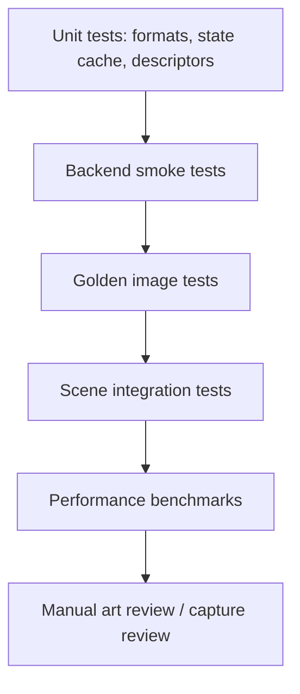

## 10.2 Unit tests

### Backend-independent

```text
RenderStateTests
SurfaceFormatMappingTests
MaterialNormalizerTests
PbrParameterTests
FrameGraphDependencyTests
ImageDiffTests
```

### OpenGL backend

```text
OpenGLTextureCreationTests
OpenGLRenderTargetTests
OpenGLShaderReflectionCompatibilityTests
OpenGLStateCacheTests
```

### Vulkan backend

```text
VulkanInstanceTests
VulkanFormatMappingTests
VulkanDescriptorLayoutTests
VulkanPipelineKeyTests
VulkanResourceStateTransitionTests
VulkanMemoryAllocatorTests
VulkanSwapchainSmokeTests
```

## 10.3 Integration tests

### Golden render test template

```csharp
[Fact]
[Trait("Category", "RenderGolden")]
public async Task Golden_PbrShip_OpenGL()
{
    using var harness = await RenderHarness.Create(RendererKind.OpenGL, RenderDeterminismSettings.Default);
    var image = await harness.RenderScene("golden_pbr_ship", 1920, 1080);
    var diff = ImageDiff.Compare(image, "GoldenBaselines/opengl/golden_pbr_ship.png");
    Assert.True(diff.Ssim >= 0.999, diff.ToString());
}
```

### Scene list

| Test | Objects | What it catches |
|---|---|---|
| `golden_basic_ship` | single ship | vertex layout, basic material |
| `golden_pbr_ship` | normal/metal/rough maps | PBR channels |
| `golden_glass_station` | glass material | alpha sorting/refraction |
| `golden_asteroid_field` | asteroid chunks | instancing/culling |
| `golden_nebula` | nebula renderer | fog/colors/depth |
| `golden_particles` | engine trail, weapon FX | particles/emissive/bloom |
| `golden_starsphere` | starsphere | depth range/background |
| `golden_ui` | UI overlay | SDR composite |
| `golden_shadow_csm` | sun + ship + station | CSM stability |
| `golden_rt_reflection` | metallic/glass | RT feature fallback |

## 10.4 Benchmarks

### Benchmark metrics

```json
{
  "scene": "asteroid_heavy",
  "backend": "vulkan",
  "resolution": "3840x2160",
  "preset": "ultra_rtx",
  "frames": 600,
  "avg_fps": 142.3,
  "p1_fps": 118.4,
  "gpu_ms_avg": 6.5,
  "gpu_ms_p95": 7.9,
  "cpu_render_ms_avg": 1.8,
  "vram_mb": 6230,
  "draw_calls": 18422,
  "triangles": 14800000
}
```

### Mandatory scenes

| Benchmark | Goal |
|---|---|
| `bench_li01_station_approach` | station, glass, lighting |
| `bench_asteroid_dense` | asteroid renderer/mesh shader |
| `bench_nebula_combat` | volumetrics/particles |
| `bench_capital_ship_battle` | many ships/weapons |
| `bench_empty_space` | baseline overhead |
| `bench_ui_heavy` | 2D renderer/text |

## 10.5 Regression policy

Per PR:

- all non-GPU unit tests;
- material normalizer tests;
- shader compile tests;
- backend API compile.

Per GPU PR/nightly:

- OpenGL golden;
- Vulkan golden once Phase 3 exists;
- performance trend compare.

Regression thresholds:

| Metric | Fail condition |
|---|---|
| average GPU time | > 5% slower for 3 consecutive runs |
| p95 GPU time | > 8% slower |
| VRAM | > 10% increase without approval |
| golden image | below threshold |
| validation | any new error |
| shader compile | any permutation failure |

---

# 11. Риски и смягчение

## 11.1 Risk matrix

| Risk | Вероятность | Impact | Mitigation |
|---|---:|---:|---|
| GL/Vulkan визуально расходятся | High | High | Phase 0 golden tests, Phase 3 parity gates, deterministic render mode |
| Vulkan synchronization bugs | Medium | High | frame graph owns barriers, validation sync, RenderDoc/Nsight captures |
| RT performance bad on mid-tier | High | Medium | feature tiers, hybrid CSM+RT, half-res/checkerboard, denoisers |
| Mod compatibility breaks | Medium | High | no new required MAT fields, MaterialNormalizer fallbacks, compatibility presets |
| Shader permutation explosion | Medium | Medium | PSO cache, feature pruning, offline warmup |
| Team scope too large | High | High | strict phase gates, no Phase 4 before Phase 3 parity |
| DLSS/SDK licensing friction | Medium | Medium | upscaler abstraction, FSR/XeSS fallback, optional plugin |
| Driver differences NVIDIA/AMD | Medium | High | Vulkan validation, AMD test machine, avoid undefined GLSL behavior |
| Alpha sorting worsens with refraction/RT | Medium | Medium | material domains, separate refraction pass, weighted OIT later |
| Volumetrics over-budget | Medium | Medium | half/quarter res, temporal reprojection, dynamic quality |

## 11.2 Compatibility policy

Never require mod authors to add new texture channels.

For every material:

```text
old MAT -> MaterialNormalizer -> physically plausible params
```

If data missing:

- albedo from `Dc/Dt`;
- metallic default from domain/name heuristic;
- roughness default from domain/name heuristic;
- emissive from `Ec/Et`;
- alpha from `Oc/Ot`.

Every new feature must have:

```text
Enabled path
Fallback path
Debug view
Golden test
Performance budget
Config switch
```

## 11.3 Development team estimate

Recommended team:

| Role | Count | Responsibility |
|---|---:|---|
| Lead graphics engineer | 1 | architecture, reviews, Phase gates |
| Rendering engineer | 2 | OpenGL post/PBR + Vulkan backend |
| Tools/automation engineer | 1 | tests, benchmarks, captures |
| Technical artist | 1 | material heuristics, visual tuning |
| QA graphics/perf | 1 part-time | regression matrix |
| Audio/runtime support | 1 part-time Phase 5 | RT audio experiment |

Scope warning: Phase 0–3 are engine modernization. Phase 4–5 are high-end features and should not start until backend stability exists.

---

# 12. Implementation backlog by file area

## 12.1 `LibreLancer.Base/Graphics`

| Area | Action |
|---|---|
| `RenderContext` | convert to frontend facade over `IRenderBackend`; reduce GL assumptions |
| `RenderTarget2D` | explicit color/depth formats; HDR constructor |
| `MultisampleTarget` | explicit color format, HDR MSAA resolve |
| `Texture2D` | richer descriptors and usage flags |
| `ShaderBundle` | expose SPIR-V/reflection path for Vulkan |
| `Renderer2D` | backend command-list path; UI after post processing |
| `Backends/OpenGL` | wrap as `OpenGLRenderBackend` |
| `Backends/Vulkan` | new backend implementation |
| `Backends/Null` | keep for unit/headless tests |

## 12.2 `LibreLancer/Render`

| Area | Action |
|---|---|
| `SystemRenderer` | split scene draw from final present; frame graph integration |
| `CommandBuffer` | split into queue builder + backend encoder |
| `RenderMaterial` | material domain flags, PBR constants, shadow flags |
| `BasicMaterial` | linear HDR PBR, IBL/shadows bindings |
| `NebulaRenderer` | volumetric-ready abstraction |
| `AsteroidFieldRenderer` | meshlet/mesh shader future path |
| `FxPool` / particles | emissive extraction, reactive masks, async compute later |
| `LightEquipRenderer` | local shadow priority inputs |
| `DebugRenderer` | debug views and markers |

## 12.3 `LibreLancer/Shaders`

Add:

```text
Post/Tonemap.frag.hlsl
Post/BloomExtract.frag.hlsl
Post/BloomDownsample.frag.hlsl
Post/BloomUpsample.frag.hlsl
Post/GodRaysMask.frag.hlsl
Post/GodRaysRadialBlur.frag.hlsl
Post/FXAA.frag.hlsl
Post/SMAA_*.hlsl
Lighting/PBR_IBL.hlsl
Lighting/Shadows.hlsl
Lighting/BRDF.hlsl
RT/RayTracedShadows.rgen/rmiss/rchit
RT/RTAO.*
RT/Reflections.*
Volumetric/NebulaRaymarch.comp.hlsl
```

## 12.4 `LibreLancer.Tests`

Add:

```text
Render/
  ImageDiff.cs
  RenderHarness.cs
  RenderGoldenTest.cs
  BackendResourceTests.cs
  VulkanBackendTests.cs
  MaterialNormalizerTests.cs
  GoldenBaselines/
```

---

# 13. Graphics settings model

```ini
[graphics]
renderer = opengl
preset = high

hdr = true
tonemapper = aces
exposure = 1.0

anti_aliasing = smaa
msaa_samples = 0

bloom = true
bloom_quality = high
bloom_threshold = 1.2
bloom_intensity = 0.18

god_rays = true
god_rays_quality = medium

pbr = true
ibl = true
shadow_quality = high
csm_cascades = 4
local_shadow_count = 8

[vulkan]
validation = false
async_compute = true
pipeline_cache = true

[raytracing]
enabled = auto
rt_shadows = true
rtao = true
rt_reflections = true

[advanced_graphics]
volumetric_nebulae = true
ddgi = false
vrs = true
mesh_shaders = auto
upscaler = dlss_streamline
frame_generation = auto
```

Runtime preset mapping:

| Preset | HDR | Bloom | IBL | Shadows | RT | Volumetrics | Upscaler |
|---|---|---|---|---|---|---|---|
| Low | off/on optional | low | ambient only | off/low | off | off | off/FSR |
| Medium | on | medium | on | medium | off | low | optional |
| High | on | high | on | high | RTAO optional | medium | optional |
| Ultra RTX | on | high | on | ultra | on | high | DLSS/FG optional |

---

# 14. Debug UI design

Add ImGui graphics panel:

```text
Graphics
  Backend
    Renderer: OpenGL/Vulkan
    GPU: ...
    Driver: ...
    VRAM budget/usage
    Validation status
  Frame
    GPU time
    CPU render time
    Present mode
    Frame graph pass list
  Post
    HDR exposure
    Tonemapper
    Bloom threshold/intensity
    God rays params
  Lighting
    PBR debug mode
    IBL probe viewer
    CSM cascade viewer
    Shadow atlas viewer
  Vulkan
    Queue timings
    Descriptor pools
    Pipeline cache hits/misses
    Resource barriers
  Ray tracing
    BLAS/TLAS stats
    Rays/pixel
    Denoiser history
  Tests
    Capture screenshot
    Capture RenderDoc
    Save golden candidate
```

---

# 15. Presentation deck outline

This section is intentionally included so the same content can be turned into a stakeholder presentation.

## Slide 1 — Why graphics roadmap now?

- OpenGL renderer works but blocks modern GPU features.
- Discovery content is rich enough to justify modern lighting.
- Vulkan migration must be staged, not a rewrite.

## Slide 2 — Current renderer reality

- `SystemRenderer.Draw()` already resembles a frame graph.
- `RenderContext` is useful but too GL-shaped.
- `CommandBuffer` is not a true backend command buffer.

## Slide 3 — Vision image

- HDR/PBR/IBL + bloom/god rays.
- Volumetric nebulae.
- RT shadows/AO/reflections.
- 4K high-refresh mode with upscaling/FG.

## Slide 4 — Phase 0: backend abstraction

- No behavior change.
- `IRenderBackend`.
- Golden screenshots.
- GL wrapped first.

## Slide 5 — Phase 1: OpenGL visual win

- HDR `RGBA16F`.
- Bloom.
- God rays.
- FXAA/SMAA.

## Slide 6 — Phase 2: lighting foundation

- Linear workflow.
- Cook-Torrance.
- IBL.
- CSM/local shadows.

## Slide 7 — Phase 3: Vulkan parity

- Swapchain.
- VMA.
- Descriptors.
- PSOs.
- Sync/barriers.
- Async compute after parity.

## Slide 8 — Phase 4: RTX/Vulkan features

- RT shadows.
- RTAO.
- RT reflections.
- Mesh shaders for asteroids.
- VRS for background.

## Slide 9 — Phase 5: advanced rendering

- Volumetric fog.
- DDGI/RTXGI-style probes.
- DLSS/Frame Generation.
- Refraction.
- Audio RT prototype.

## Slide 10 — Risk and delivery

- Feature tiers protect compatibility.
- Golden tests protect refactors.
- Strict phase gates prevent rewrite spiral.

---

# 16. First 30 days: exact execution plan

## Week 1

- [ ] Create `graphics/phase0-render-backend` branch.
- [ ] Add renderer config enum and CLI option.
- [ ] Run GL dependency inventory with `rg`.
- [ ] Add `docs/render_gl_dependency_inventory.md`.
- [ ] Add skeleton `IRenderBackend` interfaces.
- [ ] Add backend capability structs.
- [ ] Add `RenderBackendFactory`.

## Week 2

- [ ] Wrap current `GLRenderContext` as `OpenGLRenderBackend`.
- [ ] Split SDL window creation into OpenGL/Vulkan/Null binding.
- [ ] Add `RenderTarget2D` explicit format constructor.
- [ ] Add `MultisampleTarget` explicit format constructor.
- [ ] Add backend readback API for screenshots.
- [ ] Start `RenderHarness`.

## Week 3

- [ ] Add deterministic render settings.
- [ ] Add first golden scene: `golden_basic_ship`.
- [ ] Add image diff implementation.
- [ ] Add GL before/after baseline workflow.
- [ ] Add analyzer/test that fails on new direct `GL.*` outside backend.
- [ ] Begin splitting `SystemRenderer.Draw()` into scene draw + present.

## Week 4

- [ ] Finish Phase 0 GL parity tests.
- [ ] Add golden scenes: PBR ship, glass, starsphere, particles.
- [ ] Document `CommandBuffer` refactor.
- [ ] Add debug labels abstraction.
- [ ] Create Phase 1 branch plan.
- [ ] Phase 0 review: code, tests, screenshots, captures.

---

# 17. Non-goals

These are intentionally out of scope unless a later roadmap expands them:

- Replacing LibreLancer ECS.
- Changing Freelancer/Discovery asset formats.
- Requiring authors to export glTF/PBR assets.
- Moving UI away from XML/Lua.
- Converting the whole renderer to deferred shading immediately.
- Path tracing the whole scene.
- Making DLSS/RTX mandatory.
- Making Vulkan required before Phase 3 parity is proven.

---

# 18. Decision log

| Decision | Rationale |
|---|---|
| OpenGL stays through Phase 2 | Gives visual wins and stabilizes material/lighting before Vulkan |
| Vulkan comes after backend abstraction | Direct rewrite would create untestable behavior differences |
| Frame graph before Vulkan parity | Barriers/resource transitions need pass-level knowledge |
| IBL before RT reflections | RT reflections need stable material roughness/metal semantics |
| CSM before RT shadows | Raster fallback must exist for non-RT hardware |
| Mesh shaders only for asteroids first | Highest gain, isolated risk |
| Upscaler after motion vectors | DLSS/FG quality depends on motion/depth/reactive masks |
| Audio RT experimental only | Valuable but not graphics-critical |

---

# 19. Final acceptance definition for the 18-month roadmap

The roadmap is complete when:

- Project Sirius can run with `--renderer opengl` and `--renderer vulkan`.
- OpenGL and Vulkan render the same content through the same frame graph.
- OpenGL path has HDR, bloom, god rays, PBR/IBL and shadows.
- Vulkan path passes parity tests and validation.
- RTX tier supports RT shadows, RTAO and RT reflections with fallbacks.
- Asteroid-heavy scenes can use mesh shader path when supported.
- VRS can reduce background shading cost without damaging UI/foreground.
- Nebulae have volumetric depth.
- Upscaling/Frame Generation path exists behind an abstraction.
- Automated screenshot/performance regression tests run regularly.
- All new features are optional and preserve Freelancer/Discovery mod compatibility.

---

## Appendix A — Mermaid render graph for final Vulkan renderer

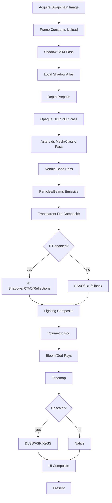

## Appendix B — Minimal backend migration checklist for PR review

- [ ] No new direct `GL.*` outside backend implementation.
- [ ] No material shader outputs gamma before tonemap.
- [ ] Every render pass declares read/write resources.
- [ ] Every new GPU resource has debug name.
- [ ] Every feature has off switch.
- [ ] Every feature has fallback.
- [ ] Every feature has debug view.
- [ ] Every feature has GPU timing.
- [ ] Every feature has screenshot baseline or visual QA case.
- [ ] Vulkan validation clean if Vulkan code touched.
- [ ] No required changes to Freelancer asset files.
